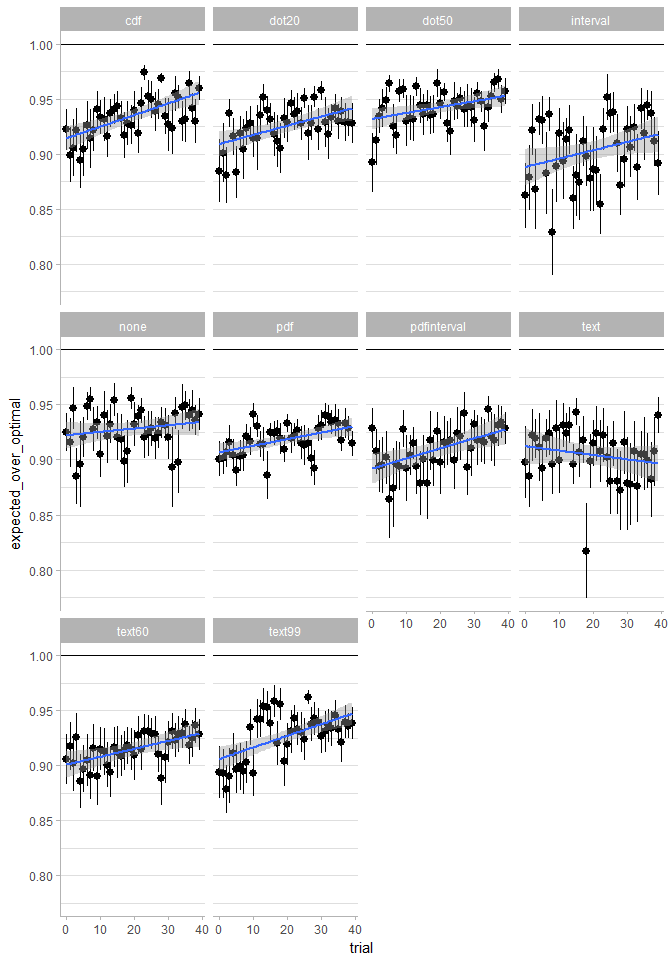
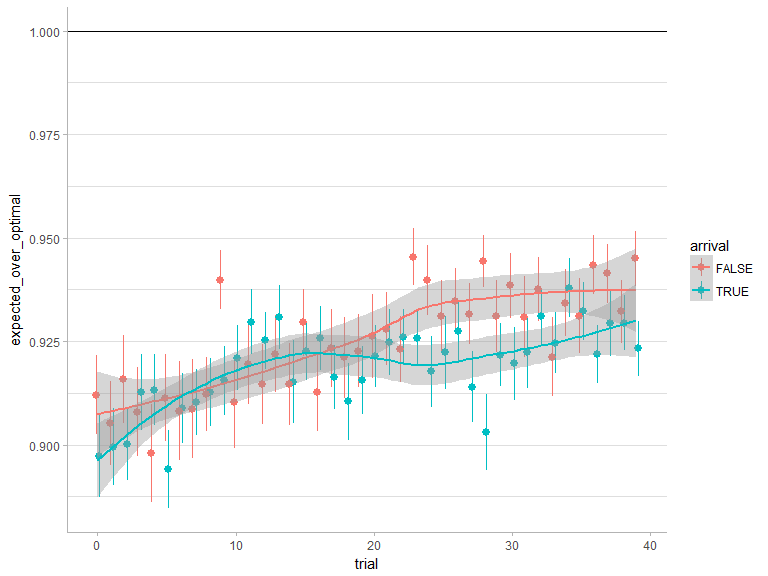
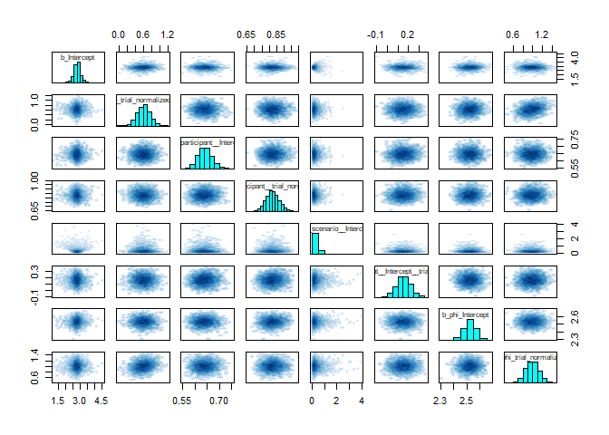
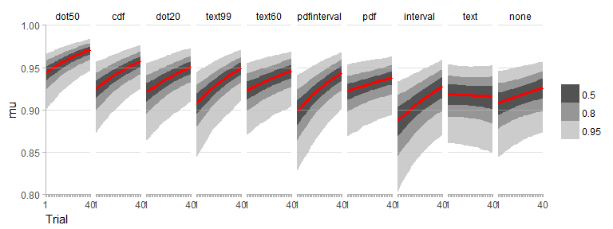
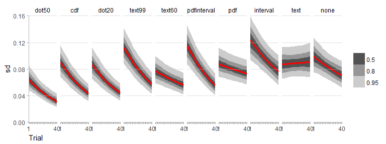

Final study analysis
================

-   [Setup](#setup)
-   [Load and clean data](#load-and-clean-data)
-   [Naive learning curves](#naive-learning-curves)
    -   [By vis](#by-vis)
    -   [By arrival](#by-arrival)
-   [Bayesian beta regression](#bayesian-beta-regression)
    -   [Model](#model)
        -   [Priors](#priors)
        -   [Fit model](#fit-model)
    -   [Posterior prediction](#posterior-prediction)
    -   [Model-based learning curves](#model-based-learning-curves)
        -   [Trends in mean](#trends-in-mean)
        -   [Trends in standard deviation](#trends-in-standard-deviation)
    -   [Performance on last trial](#performance-on-last-trial)
        -   [Mean](#mean)
        -   [Standard deviation](#standard-deviation)

Setup
=====

If you have not installed RStan previously, **install it before installing any other packages below**. Rstan can be finicky to install, so we recommend carefully following the [RStan Getting Started Guide](https://github.com/stan-dev/rstan/wiki/RStan-Getting-Started). **Do not** simply issue ~~`install.packages("rstan")`~~, as this may result in a non-working RStan installation.

Once RStan is installed, you can set up the `tidybayes` package as follows:

``` r
install.packages("devtools")
devtools::install_github("mjskay/tidybayes")
```

Finally, install any remaining packages from the list below that you do not already have using `install.packages(c("package1", "package2", ...))`. The `import::from(packagename, function)` syntax requires the `import` package to be installed.

``` r
library(magrittr)
library(stringi)
library(tidyverse)
library(modelr)
library(forcats)
library(snakecase)
library(lsmeans)
library(broom)
library(lme4)
library(dotwhisker)
library(directlabels)
library(rstan)
library(brms)
library(rlang)
library(tidybayes)
library(cowplot)
library(RColorBrewer)
library(bindrcpp)
import::from(gamlss.dist, qBCT)
import::from(boot, logit)
```

Load and clean data
===================

First, let's read in the data, do some basic name and datatype cleaning:

``` r
df = read.csv("data/final_trials.csv") %>%
  as_tibble()

head(df)
```

| vis   | arrival | participant | distribution | scenario |  trial|        mu|      sigma|         nu|       tau|  mode|  duration|  response|  payoff|  expected\_payoff|  optimal\_payoff|  expected\_over\_optimal|
|:------|:--------|:------------|:-------------|:---------|------:|---------:|----------:|----------:|---------:|-----:|---------:|---------:|-------:|-----------------:|----------------:|------------------------:|
| dot50 | FALSE   | p369        | d060         | s3       |      0|  34.43021|  0.1038757|  -7.673986|  1.969532|    18|  22.85116|        16|    2151|          1857.236|         1987.309|                0.9345483|
| dot50 | FALSE   | p369        | d036         | s3       |      1|  36.11904|  0.1151801|  -3.047448|  2.024402|    20|   8.40406|        18|    2031|          1743.631|         1916.901|                0.9096093|
| dot50 | FALSE   | p369        | d001         | s3       |      2|  24.69326|  0.0507094|  -1.711638|  1.627509|    10|  17.24604|         9|    2078|          1601.720|         1949.349|                0.8216692|
| dot50 | FALSE   | p369        | d001         | s3       |      3|  24.69326|  0.0507094|  -1.711638|  1.627509|    10|  29.20262|         9|    2095|          1601.720|         1949.349|                0.8216692|
| dot50 | FALSE   | p369        | d106         | s3       |      4|  30.73842|  0.0813301|  -2.877004|  1.845427|    15|  12.57680|        14|    2084|          1722.179|         1944.729|                0.8855624|
| dot50 | FALSE   | p369        | d067         | s3       |      5|  24.73388|  0.0508896|  -4.638728|  1.629045|    10|  11.80909|         8|    2070|          1839.135|         1967.857|                0.9345875|

The set of conditions looks like this:

``` r
df %>%
  group_by(vis, arrival) %>%
  summarise(n(), length(unique(participant)))
```

| vis         | arrival |   n()|  length(unique(participant))|
|:------------|:--------|-----:|----------------------------:|
| cdf         | FALSE   |  1092|                           25|
| cdf         | TRUE    |   599|                           15|
| dot20       | FALSE   |   685|                           17|
| dot20       | TRUE    |   734|                           18|
| dot50       | FALSE   |   635|                           16|
| dot50       | TRUE    |   705|                           17|
| interval    | FALSE   |   864|                           21|
| interval    | TRUE    |   793|                           18|
| none        | FALSE   |   651|                           16|
| none        | TRUE    |   747|                           18|
| pdf         | FALSE   |   705|                           17|
| pdf         | TRUE    |  3840|                           57|
| pdfinterval | FALSE   |   605|                           15|
| pdfinterval | TRUE    |   750|                           18|
| text        | FALSE   |   602|                           15|
| text        | TRUE    |   827|                           20|
| text60      | FALSE   |   647|                           16|
| text60      | TRUE    |   768|                           19|
| text99      | FALSE   |   537|                           13|
| text99      | TRUE    |  2616|                           41|

We will add `trial_normalized`, which will go from -0.5 (the first trial) to 0.5 (the last trial) to help model convergence.

``` r
max_trial = 39
stopifnot(max(df$trial) == max_trial)

df %<>%
  mutate(
    trial_normalized = ((trial - max_trial) / max_trial) + 0.5
  )
```

We will also add the intervals that participants would have been shown in the text conditions:

``` r
df %<>%
  mutate(
    text_interval = round(gamlss.dist::qBCT(1 - .85, mu, sigma, nu, tau) - 15),
    text60_interval = round(gamlss.dist::qBCT(1 - .60, mu, sigma, nu, tau) - 15),
    text99_interval = round(gamlss.dist::qBCT(1 - .99, mu, sigma, nu, tau) - 15)
  )
```

We'll also exclude scenario 4 for now, since it would need to be analyzed separately (because it is binary choice) and because we did not pre-register a model for it:

``` r
df %<>%
  filter(scenario != "s4") %>%
  mutate(scenario = factor(scenario))
```

Finally, for the beta regression models, we will need `expected_over_optimal` to be guaranteed to be between 0 and 1 (exclusive) --- currently it is between 0 and 1 (inclusive). So we'll create an "adjusted" normalized response that is guaranteed to be between 0 and 1 (exclusive). This just adjusts values that would be 1 downward slightly:

``` r
df %<>%
  mutate(
    expected_over_optimal_adjusted = ifelse(expected_payoff == optimal_payoff, 
      optimal_payoff / (optimal_payoff + 1),
      expected_payoff / optimal_payoff
    )
  )
```

This transformation does not substantially change responses, but does allow us to use the logit transformation on them (or use the beta distribution to model them, as we will see shortly). You can see that the distributions are essentially identical (black is original, red is adjusted):

``` r
df %>%
  filter(trial > 35) %>% #just look at the last couple of trials
  ggplot(aes(x = expected_over_optimal)) +
  stat_density() +
  stat_density(aes(x = expected_over_optimal_adjusted), fill = NA, color = "red") +
  facet_wrap(~ vis)
```


These plots show distributions of responses in each condition in the last 5 trials. This also suggests that beta regression might be an appropriate choice, since the conditional distributions are beta-like.

An excerpt from the cleaned dataset:

``` r
head(df)
```

| vis   | arrival | participant | distribution | scenario |  trial|        mu|      sigma|         nu|       tau|  mode|  duration|  response|  payoff|  expected\_payoff|  optimal\_payoff|  expected\_over\_optimal|  trial\_normalized|  text\_interval|  text60\_interval|  text99\_interval|  expected\_over\_optimal\_adjusted|
|:------|:--------|:------------|:-------------|:---------|------:|---------:|----------:|----------:|---------:|-----:|---------:|---------:|-------:|-----------------:|----------------:|------------------------:|------------------:|---------------:|-----------------:|-----------------:|----------------------------------:|
| dot50 | FALSE   | p369        | d060         | s3       |      0|  34.43021|  0.1038757|  -7.673986|  1.969532|    18|  22.85116|        16|    2151|          1857.236|         1987.309|                0.9345483|         -0.5000000|              16|                18|                12|                          0.9345483|
| dot50 | FALSE   | p369        | d036         | s3       |      1|  36.11904|  0.1151801|  -3.047448|  2.024402|    20|   8.40406|        18|    2031|          1743.631|         1916.901|                0.9096093|         -0.4743590|              17|                20|                 9|                          0.9096093|
| dot50 | FALSE   | p369        | d001         | s3       |      2|  24.69326|  0.0507094|  -1.711638|  1.627509|    10|  17.24604|         9|    2078|          1601.720|         1949.349|                0.8216692|         -0.4487179|               8|                 9|                 2|                          0.8216692|
| dot50 | FALSE   | p369        | d001         | s3       |      3|  24.69326|  0.0507094|  -1.711638|  1.627509|    10|  29.20262|         9|    2095|          1601.720|         1949.349|                0.8216692|         -0.4230769|               8|                 9|                 2|                          0.8216692|
| dot50 | FALSE   | p369        | d106         | s3       |      4|  30.73842|  0.0813301|  -2.877004|  1.845427|    15|  12.57680|        14|    2084|          1722.179|         1944.729|                0.8855624|         -0.3974359|              13|                15|                 6|                          0.8855624|
| dot50 | FALSE   | p369        | d067         | s3       |      5|  24.73388|  0.0508896|  -4.638728|  1.629045|    10|  11.80909|         8|    2070|          1839.135|         1967.857|                0.9345875|         -0.3717949|               8|                 9|                 4|                          0.9345875|

Naive learning curves
=====================

By vis
------

Let's start with a high-level view (and a somewhat poor model: linear without accounting for participant or scenario) to see how people improve over the course of the trials in the different conditions:

``` r
df %>%
  ggplot(aes(x = trial, y = expected_over_optimal)) +
  stat_summary(fun.data = mean_se) +
  geom_hline(yintercept = 1) +
  stat_smooth(method = lm) +
  facet_wrap(~ vis)
```



By arrival
----------

The other question is if providing the arrival information at the right makes a difference.

``` r
df %>%
  ggplot(aes(x = trial, y = expected_over_optimal, color = arrival)) +
  stat_summary(fun.data = mean_se, position = position_dodge(width = .5)) +
  geom_hline(yintercept = 1) +
  stat_smooth(method = loess) 
```



It doesn't seem to make a huge difference, so for simplicity we will pool the arrival variants. We saw something similar in the pilot analysis, and a pooled model for arrival is what we [pre-registered](http://aspredicted.org/blind.php?x=g2yb2f).

Bayesian beta regression
========================

One of the displeasing aspects of applying a linear model here is that it won't work well for prediction --- the data is skewed and bounded above at 1. Since normalized responses will always be between 0 and 1, a logit transformation might help here. This would also ensure that learning curves can approach -- but never pass --- optimal, which is a property we should expect them to have.

Model
-----

To build a model for these data, we'll use a beta regression, which is bounded on (0,1), and uses a logit link.

### Priors

These are the priors we can set:

``` r
get_prior(bf(
    expected_over_optimal_adjusted ~ trial_normalized + (trial_normalized|participant) + (1|scenario), 
    phi ~ vis*trial_normalized
  ),
  data = df, family = Beta)
```

| prior                | class     | coef                             | group       | resp | dpar | nlpar | bound |
|:---------------------|:----------|:---------------------------------|:------------|:-----|:-----|:------|:------|
|                      | b         |                                  |             |      |      |       |       |
|                      | b         | Intercept                        |             |      |      |       |       |
|                      | b         | trial\_normalized                |             |      |      |       |       |
| lkj(1)               | cor       |                                  |             |      |      |       |       |
|                      | cor       |                                  | participant |      |      |       |       |
|                      | Intercept |                                  |             |      |      |       |       |
| student\_t(3, 0, 10) | sd        |                                  |             |      |      |       |       |
|                      | sd        |                                  | participant |      |      |       |       |
|                      | sd        | Intercept                        | participant |      |      |       |       |
|                      | sd        | trial\_normalized                | participant |      |      |       |       |
|                      | sd        |                                  | scenario    |      |      |       |       |
|                      | sd        | Intercept                        | scenario    |      |      |       |       |
|                      | b         |                                  |             |      | phi  |       |       |
|                      | b         | Intercept                        |             |      | phi  |       |       |
|                      | b         | trial\_normalized                |             |      | phi  |       |       |
|                      | b         | visdot20                         |             |      | phi  |       |       |
|                      | b         | visdot20:trial\_normalized       |             |      | phi  |       |       |
|                      | b         | visdot50                         |             |      | phi  |       |       |
|                      | b         | visdot50:trial\_normalized       |             |      | phi  |       |       |
|                      | b         | visinterval                      |             |      | phi  |       |       |
|                      | b         | visinterval:trial\_normalized    |             |      | phi  |       |       |
|                      | b         | visnone                          |             |      | phi  |       |       |
|                      | b         | visnone:trial\_normalized        |             |      | phi  |       |       |
|                      | b         | vispdf                           |             |      | phi  |       |       |
|                      | b         | vispdf:trial\_normalized         |             |      | phi  |       |       |
|                      | b         | vispdfinterval                   |             |      | phi  |       |       |
|                      | b         | vispdfinterval:trial\_normalized |             |      | phi  |       |       |
|                      | b         | vistext                          |             |      | phi  |       |       |
|                      | b         | vistext:trial\_normalized        |             |      | phi  |       |       |
|                      | b         | vistext60                        |             |      | phi  |       |       |
|                      | b         | vistext60:trial\_normalized      |             |      | phi  |       |       |
|                      | b         | vistext99                        |             |      | phi  |       |       |
|                      | b         | vistext99:trial\_normalized      |             |      | phi  |       |       |
|                      | Intercept |                                  |             |      | phi  |       |       |

We'll set weakly-informed priors for the various classes of coefficients, as per [our pre-registration](http://aspredicted.org/blind.php?x=g2yb2f):

``` r
pr_beta = c(
  prior(normal(0, 1), class = b),
  # these prior intercepts are wide and cover 0 (50% on the logit scale), but
  # also assume some likely better-than-50% performance on average --- this
  # was chosen to aid convergence during the pilot, but does not have a strong
  # impact on final estimates.
  prior(normal(2, 2), class = Intercept),
  prior(normal(2, 2), class = Intercept, dpar = phi),
  prior(normal(0, 1), class = b, dpar = phi),
  prior(student_t(3, 0, 1), class = sd)
)
```

### Fit model

Let's fit the model:

``` r
warmup = 2000
iter = warmup + 2000
thin = 2

mbeta = brm(bf(
    expected_over_optimal_adjusted ~ vis*trial_normalized + (trial_normalized|participant) + (1|scenario), 
    phi ~ vis*trial_normalized),
  data = df, prior = pr_beta, 
  control = list(adapt_delta = 0.9995, max_treedepth = 15, stepsize = 0.005),
  warmup = warmup, iter = iter, thin = thin,
  family = Beta
  )
```

Note that the above model takes a long time to run (about 24 hours), primarily because we are estimating a random effect for a factor with only three groups (scenario)---See Gelman (2006), *Prior distributions for variance parameters in hierarchical models* for more discussion of this issue. In retrospect we should have pre-registered a zero-avoiding prior for variance hyperpriors (with a non-zero-centered tighter truncated t prior it only takes an hour or two to fit and yields relatively similar estimates), but we pre-registered the above priors, so we'll stick to them. To save time we'll just load the fitted model from disk:

``` r
mbeta = read_rds("models/final_model.rds")
```

Some model diagnostics (note the funnel shape on `sd_scenario__Intercept`, this is why our model takes awhile to fit):

``` r
pairs(mbeta$fit, pars = c("b_Intercept", "b_trial_normalized", "sd_participant__Intercept",  "sd_participant__trial_normalized", 
  "sd_scenario__Intercept",  
  "cor_participant__Intercept__trial_normalized", "b_phi_Intercept", "b_phi_trial_normalized"))
```



Posterior prediction
--------------------

We'll start with posterior predictions. First we'll decide on a display order for consistency across charts:

``` r
vis_display_order = c("dot50", "cdf", "dot20", "text99", "text60", "pdfinterval", "pdf", "interval", "text", "none")
```

Then we'll generate posterior predictions:

``` r
pred_beta = 
  df %>%
  data_grid(
    vis,
    trial_normalized = seq_range(trial_normalized, n = 20)
  ) %>%
  add_predicted_samples(mbeta, re_formula = NULL, allow_new_levels = TRUE) %>%    
  mean_qi(.prob = c(.95, .8, .5))
```

And plot them, along with data (note that some conditions, notably `pdf`, had more data collected):

``` r
# shared properties of posterior prediction and fit line plots
fit_line_plot_settings = list(
  scale_x_continuous(breaks = seq(-0.5, 0.5, length.out = 40), labels = c("1", rep("", 38), "40")),
  coord_cartesian(expand = FALSE),
  xlab("Trial"),
  theme(
    panel.grid = element_blank(), panel.spacing.x = unit(5, "points"),
    strip.background = element_blank(), strip.text = element_text(hjust = 0.5, color = "black"),
    axis.title.x = element_text(hjust = 0)
  ))

post_pred_plot = pred_beta %>%
  ungroup() %>%
  mutate(vis = fct_relevel(vis, vis_display_order)) %>%
  ggplot(aes(x = trial_normalized)) +
  geom_lineribbon(aes(y = pred), data = pred_beta) +
  geom_hline(yintercept = 1) +
  scale_fill_brewer(guide = guide_legend(reverse = TRUE)) +
  geom_hline(yintercept = seq(.4, .95, by=.1), color="gray75", alpha = 0.5) +
  fit_line_plot_settings + 
  facet_grid(. ~ vis) +
  ylab("Performance / Optimal strategy")
post_pred_plot +
  geom_point(aes(y = expected_over_optimal), alpha = 0.05, data = df) 
```


Above, the red line is the predicted median, and the blue bands are predictive intervals for the data. We can see that most conditions get better both in terms of bias and variance over time: people get closer to optimal, and variance in performance decreases (people get more consistent). However, there are some differences, and it is hard to tell how reliable those differences are just by looking at predictions. So, let's look at posteriors for the mean and precision of estimates according to the model.

Model-based learning curves
---------------------------

First we'll generate samples of fit lines for mu and phi. We will use these to plot fit lines and to generate estimates for performance in the last trial. These estimates will be for the "average" scenario and "average" person:

``` r
fit_lines = df %>%
  data_grid(
    vis,
    trial_normalized = seq_range(trial_normalized, n = 20)
  ) %>%
  add_fitted_samples(mbeta, re_formula = NA, var = "mu") %>%
  ungroup() %>%
  mutate(vis = fct_relevel(vis, vis_display_order))
```

The estimates of *ϕ* (`phi`, the precision parameter of the beta distribution) are a little hard to interpret, so instead we'll derive a posterior distribution for standard deviation. We can use the fact that the standard deviation *σ* of a Beta distribution is:

$$
\\sigma = \\sqrt{\\frac{\\mu (1 - \\mu)}{(1 + \\phi)}}
$$

Thus we can transform samples from the distribution of *μ* (`mu`) and *ϕ* (`phi`) into samples from the distribution of *σ* (`sd`):

``` r
fit_lines %<>%
  mutate(sd = sqrt(mu * (1 - mu) / (1 + phi)))
```

### Trends in mean

Estimates of the mean for the "average" scenario and "average" person:

``` r
scale_fill_fit_lines = scale_fill_manual(
  values = RColorBrewer::brewer.pal(4, "Greys")[-1], guide = guide_legend(reverse = TRUE)
)

mu_lines_plot = fit_lines %>%
  ggplot(aes(x = trial_normalized, y = mu)) +
  stat_lineribbon(.prob = c(.95, .8, .5)) +
  geom_hline(yintercept = seq(.8, 1, by=.05), color="gray75", alpha = 0.5) +
  facet_grid(. ~ vis) +
  scale_fill_fit_lines +
  fit_line_plot_settings
mu_lines_plot
```



### Trends in standard deviation

Estimates of the standard deviation for the "average" scenario and "average" person:

``` r
sd_lines_plot = fit_lines %>%
  ggplot(aes(x = trial_normalized, y = sd)) +
  stat_lineribbon(.prob = c(.95, .8, .5)) +
  geom_hline(yintercept = seq(0, .16, by=.04), color="gray75", alpha = 0.5) +
  facet_grid(. ~ vis) +
  scale_fill_fit_lines +
  fit_line_plot_settings
sd_lines_plot
```



Performance on last trial
-------------------------

The above trend lines let us see more clearly how performance evolved as people learned. But how did people perform in the last trial? Let's get estimates of the mean and precision for the "average" person in the "average" scenario on the last trial:

``` r
last_trial = df %>%
  data_grid(
    vis,
    trial_normalized = 0.5  # because we normalized trial to be from -0.5 to 0.5
  ) %>%
  add_fitted_samples(mbeta, re_formula = NA, var = "mu") %>%
  ungroup() %>%
  mutate(vis = fct_rev(fct_relevel(vis, vis_display_order))) %>%
  mutate(sd = sqrt(mu * (1 - mu) / (1 + phi)))
```

### Mean

Conditional means (for "average" person on "average" scenario) on last trial:

``` r
plot_means = last_trial %>%
  ggplot(aes(y = vis, x = mu)) +
  geom_halfeyeh(fun.data = median_qih, fatten.point = 1.3) +
  geom_vline(xintercept = 1, linetype = "dashed", color = "black") +
  coord_cartesian(xlim = c(0.85, 1.0), ylim = c(1, 10.5)) 
plot_means
```

    ## Picking joint bandwidth of 0.00226


Let's look at differences between each condition and the control (no uncertainty) and best-performing (dot50) conditions.

Difference to control:

``` r
plot_means_vs_text = last_trial %>%
  mutate(vis = fct_relevel(vis, "none")) %>%
  compare_levels(mu, by = vis, comparison = control) %>%
  mutate(vis = factor(vis, levels = c("none - none", levels(vis)))) %>%
  bind_rows(data_frame(vis = factor("none - none", levels = levels(.$vis)), mu = 0)) %>%
  ggplot(aes(y = vis, x = mu)) +
  geom_halfeyeh(fun.data = median_qih, fatten.point = 1.3) +
  geom_vline(xintercept = 0, color = "black", linetype = "dashed") +
  coord_cartesian(xlim = c(-0.05, 0.09), ylim = c(1, 10.5))
plot_means_vs_text
```

    ## Picking joint bandwidth of 0.00259


Difference to dot50:

``` r
plot_means_vs_dot50 = last_trial %>%
  mutate(vis = fct_relevel(vis, "dot50")) %>%
  compare_levels(mu, by = vis, comparison = control) %>%
  mutate(vis = factor(vis, levels = c(levels(vis), "dot50 - dot50"))) %>%
  bind_rows(data_frame(vis = factor("dot50 - dot50", levels = levels(.$vis)), mu = 0)) %>%
  ggplot(aes(y = vis, x = mu)) +
  geom_vline(xintercept = 0, color = "black", linetype = "dashed") +
  geom_halfeyeh(fun.data = median_qih, fatten.point = 1.3) +
  coord_cartesian(xlim = c(-0.11, 0.01), ylim = c(1, 10.5))
plot_means_vs_dot50
```

    ## Picking joint bandwidth of 0.00205


### Standard deviation

Conditional standard deviation (for "average" person on "average" scenario) on last trial:

``` r
plot_prec = last_trial %>%
  ggplot(aes(y = vis, x = sd)) +
  geom_halfeyeh(fun.data = median_qih, fatten.point = 1.3) +
  geom_vline(xintercept = 0, color = "black", linetype = "dashed") +
  coord_cartesian(xlim = c(0, .12), ylim = c(1, 10.5))
plot_prec
```

    ## Picking joint bandwidth of 0.00127


Difference to control:

``` r
plot_prec_vs_text = last_trial %>%
  mutate(vis = fct_relevel(vis, "none")) %>%
  compare_levels(sd, by = vis, comparison = control) %>%
  mutate(vis = factor(vis, levels = c("none - none", levels(vis)))) %>%
  bind_rows(data_frame(vis = factor("none - none", levels = levels(.$vis)), sd = 0)) %>%
  ggplot(aes(y = vis, x = sd)) +
  geom_halfeyeh(fun.data = median_qih, fatten.point = 1.3) +
  geom_vline(xintercept = 0, color = "black", linetype = "dashed") +
  coord_cartesian(ylim = c(1, 10.5), xlim = c(-.06, 0.05))
plot_prec_vs_text
```

    ## Picking joint bandwidth of 0.0015


Difference to dot50:

``` r
plot_prec_vs_dot50 = last_trial %>%
  mutate(vis = fct_relevel(vis, "dot50")) %>%
  compare_levels(sd, by = vis, comparison = control) %>%
  mutate(vis = factor(vis, levels = c(levels(vis), "dot50 - dot50"))) %>%
  bind_rows(data_frame(vis = factor("dot50 - dot50", levels = levels(.$vis)), sd = 0)) %>%
  ggplot(aes(y = vis, x = sd)) +
  geom_vline(xintercept = 0, color = "black", linetype = "dashed") +
  geom_halfeyeh(fun.data = median_qih, fatten.point = 1.3) +
  coord_cartesian(xlim = c(0, .085), ylim = c(1, 10.5))
plot_prec_vs_dot50
```

    ## Picking joint bandwidth of 0.00123


